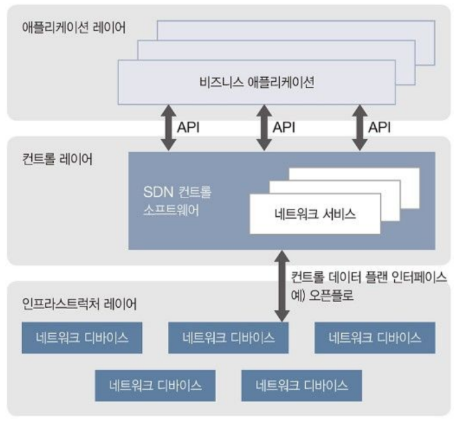
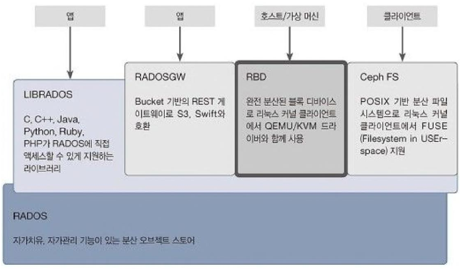

# 1장 인프라 화견 변화의 시작, 클라우드

---

### 1.1 클라우드 컴퓨팅의 정의와 종류

- 클라우드 컴퓨팅의 정의
    - 클라우드 컴퓨팅은 인터넷이 가능한 디바이스로 제 3의 공간인 클라우드에서 데이터를 읽고 쓰고, 정보를 분석해 처리하며, 이를 저장하고 관리하는 컴퓨팅 시스템입니다.

- 클라우드 서비스의 종류

    

    - IaaS(Infrastructure as a Service)
        - 서버, 스토리지, 네트워크를 가상화 환경으로 만들어 필요에 따라 인프라 자원을 사용할 수 있게 제공하는 서비스
        - 서버로 사용할 리눅스나 윈도우 서버를 호스팅 업체에 임대하는 것
        - EX : AWS의 EC2(Elastic Computing Cloud), S3(Simple Storage Service)
    - PaaS(Platform as a Service)

        
    
        - 이어서 설명할 SaaS 개념을 개발 플랫폼으로 확장한 것으로, 웹에서 개발 플랫폼을 쉽게 빌려 쓸 수 있는 서비스
        - API 서비스도 PaaS 서비스의 일부이다.
        - EX
            - 웹 사이트를 구축한다고 가정할 때, 개발자는 DB 서버와 웹 서버를 구축해야 하는데 이때 필요한 서비스가 PaaS이다. DB 서버나 웹 서버를 이미 구축해 놓았다면 개발 환경을 설정하려고 몇 날 며칠을 고생하지 않아도 된다.
            - 네이버나 다음에서 제공하는 뉴스를 보여 주거나 케이웨더에서 제공하는 날씨 정보를 보여 주는 웹 페이지를 개발한다고 가정했을 때, 이때 네이버나 다음에서 제공하는 뉴스 API나 케이웨더에서 제공한는 API를 이용한다면 좀 더 쉽게 웹 페이지를 구현할 수 있다.
    - SaaS(Software as a Service)
        - IaaS와 PaaS 위에 올라가는 소프트웨어를 말한다.
        - On-demand Software라고도 한다.
        - 중앙에서 호스팅되는 소프트웨어를 웹 브라우저 등 클라이언트로 이용하는 서비스이다.
        - **클라우드 환경에서 동작하는 모든 어플리케이션(응용 프로그램)**
        - EX
            - IaaS에서 서비스 되는 가상 인스턴스(가상 서버)에 웹 서버와 WAS를 설치하고, DB 서버를 연동해 웹 사이트를 구축했다면 이것이 바로 SaaS가 된다.
            - 구글 Docs
    - DaaS(Desktop as a Service)
        - 클라우드 인프라를 이용해 일반 사용자용 윈도우 등 데스크탑 운영체제가 설치된 인스턴스를 서비스받는 것.
        - 개인용 컴퓨터가 없어도 클라우드와 연결이 가능한 단말기만 있으면 언제든지 클라우드에 접속해 일할 수 있다.
        - 공공기관이나 대기업, 은행처럼 주로 보안이 중요한 곳에서 데이터 유출이나 불법 소프트웨어 사용을 방지한다.
    - BaaS(Backend as a Service)
        - 모발인 환경에서 구현하기 복잡하고 힘든 서버 사이드 서비스를 API 서비스로 제공해서 모바일 앱이나 웹을 개발할 때 UI/UX에 집중할 수 있도록 하는 서비스이다.
        - 무겁고 어려운 비즈니스 로직은 직접 구현하지 않고도 필요에 따라 클라우드 서버에 이미 구축된 백엔드 서비스로 쉽게 구현할 수 있다.

- 클라우드의 공개 범위
    - public Cloud
        - 아마존이나 구글, 마이크로소프트 등 서비스 제공자에게서 서버나 스토리지를 제공받아 PaaS 같은 개발 환경이나 SaaS에 해당하는 소프트웨어 서비스를 하는 것을 통칭해서 퍼블릭 클라우드라고 한다.
        - 인터넷만 되면 언제 어디서든지 접근이 가능한 서버, 스토리지, 개발 환경, 소프트웨어를 퍼블릭 클라우드라고 한다.
    - private Cloud
        - 퍼블릭 클라우드의 반대 : 인터넷에 공개하지 않겠다.
        - 내부에서만 쓸 수 있게 별도의 서버나 스토리지 자원으로 클라우드 컴퓨팅 시스템을 구축하고, 거기서만 사용한는 개발 환경, 소프트웨어를 프라이빗 클라우드라고 한다.
    - hybrid Cloud
        - 퍼블릭 클라우드와 프라이빗 클라우드를 모두 관리하는 방법 :: 하이브리드 클라우드 관리 시스템
        - 퍼블릭 클라우드 영역에 있는 인스턴스를 언제든지 프라이빗 클라우드 영역으로 가져올 수 있고, 프라이빗 클라우드 영역에 있는 인스턴스를 퍼블릭 클라우드 영역으로 내보낼 수 있는 클라우드 시스템.

---

### 1.2 클라우드 핵심 서비스 컴퓨트와 스토리지(IaaS)

- 컴퓨트 서비스
    - 사용자가 원하는 운영체제가 탑재된 컴퓨터나 서버를 인터넷에서 사용할 수 있게 제공하는 유료 또는 무료 서비스를 말한다.
    - 시스템을 구축할 때 필요한 서버를 가상으로 할당해 주는 서비스로, 이때 할당하는 가상 서버를 인스턴스라고 한다.
    - 인스턴스의 생성 기전 : CPU, 메모리, 하드 디스크 용량, 운영체제

- 스토리지 서비스
    - N 드라이브, Cloudike, DropBox, 아마존 클라우드 드라이브, 구글 드라이브 등
    - 컴퓨트 서비스와 다르게 어떤 서비스를 제공하느냐에 따라 IaaS 범위에 해당하는 서비스일 수 있고, SaaS 범위에 해당하는 서비스일 수도 있다.
    - IaaS는 하드웨어 자체를 서비스로 제공한다.
    - SaaS는 사용하기 쉽고 편리한 인터페이스를 제공한다. 완성된 소프트웨어를 제공한다면 SaaS에 해당한다.
    - IaaS에 해당하는 스토리지 서비스
        - 스토리지와 스토리지에 접근할 수 있는 REST API만을 제공하는 서비스
        - 개발로 서비스되는 스토리지
        - EX
            - 아마존의 S3
            - 오픈스택의 오브젝트 스토리지인 Swift

---

### 1.3 하이퍼바이저(Hypervisor)의 정의와 종류

- 정의
    - 호스트 컴퓨터 한 대에서 운영체제 다수를 동시에 실행하는 논리적 플랫폼
    - 가상 머신 모니터라고도 한다.

    

- 분류
    - Native(또는 베어메탈) 방식 : 하드웨어에 직접 설치해서 실행되는
    - Hosted 방식 : 일반 애플리케이션처럼 프로그램으로 설치되는

    - Native(또는 베어메탈)
        - 게스트 운영체제는 이미 하드웨어에 설치된 하이퍼바이저에서 두 번째 수준으로 실행된다.
        - 하드웨어에 운영체제 대신 Xen, KVM, XenServer 같은 하이퍼바이저가 설치되고, 설치된 하이퍼바이저 위에 서로 다른 운영체제가 실행되는 방식
        - TYPE1이라고도 한다.
        - 종류 : Xen, 시트릭스의 Xen Server, VMware의 ESX Server, L4 microkernel, TRANGO, IBM의 POWER 하이퍼바이저(PR/SM) 등이 있다.
        - 플랫폼의 펌웨어에 하이퍼바이저를 넣은 히다치의 Virtage와 하이퍼바지어 안에 완전한 리눅스 커널을 넣은 KVM도 TYPE1에 해당한다.

        

    - Hosted
        - 가상 머신 안에서 동작되는 게스트 운영체제는 하드웨어에서 세 번째 수준으로 실행된다.
        - VMware Workstation, VirtualBox를 설치하고 다른 운영체제를 띄우는 방식
        - TYPE2라고도 한다.

        

- 가상화 방식에 따른 하이퍼바이저
    - **어떻게 설치하느냐 : Native, Hosted**
    - **어떤 방식으로 가상화를 했느냐 : ????**
    
    - 전가상화(Full Virtualization)
        - 하드웨어를 모두 가상화한 것.
        - 하드웨어를 모두 가상화했기 때문에 게스트 운영체제를 변경하지 않고 다양한 운영체제로 이용할 수 있다는 장점이 있다.
        - 전가상화 조건으로는 물리적인 가상화를 지원하는 CPU의 가상화 기술을 이용해야만 한다.
        - Native 방식의 하이퍼바이저를 전가상화 방식이라고 생각하면 된다.
        - CPU를 직접 사용하므로 윈도우를 설치할 수 있다.
        - 리눅스 같은 오픈소스들을 설치할 수 있으면 반 가상화 방식이라고 생각하면 된다.
        - 오픈 스택의 기본 하이퍼바이저인 KVM은 윈도우를 게스트로 설치할 수 있으므로 전가상화 방식을 지원한다고 할 수 있다.

        

    - 반가상화(Para Virtualization)
        - 하드웨어를 완전하게 가상화하지 않은 것.
        - 게스트 운영체제가 하드웨어를 직접 제어할 수 없고, 하이퍼바이저로만 제어가 가능하다.
        - 하이퍼바이저가 모든 것을 제어하기 때문에 높은 성능을 유지할 수 있다.
        - 반가상화 방식은 게스트 운영체제의 커널 일부분을 변경해야하는 단점이 있기 때문에 오픈 소스가 아닌 운영체제에서는 운영할 수 없다는 문제점이 있다.
        - KVM은 전가상화, 반가상화를 모두 지원하는 하이퍼바이저이다.

        

- 다양한 종류의 하이퍼바이저
    - KVM
        - 오픈 스택의 기본 하이퍼바이저인 KVM(for Kernel-based Virtual Machine)은 커널 기반으로 전가상화 방식을 지원하는 오픈 소스 하이퍼바이저이다.
        - 반드시 가상화가 지원되는 Intel VT나 AMD-V가 있어야만 사용할 수 있다.
        - KVM을 사용하면 리눅스나 윈도 이미지를 수정하지 않고 여러 가상 머신으로 실행할 수 있다.
        - KVM으로 각 가상 머신은 네트워크 인터페이스 카드, 디스크, 그래픽 어댑터 같은 가상화된 하드웨어를 가질 수 있다.
        
        

        - 위 그림의 아키텍처는 KVM 모듈이 어떻게 구성되어 있는지 보여준다. 하드웨어는 가상화 기술이 있는 x86을 지원하고 리눅스 커널 안에 KVM 모듈이 포함되어 있음을 확인할 수 있다. 게스트 사용자 전용 프로세스는 QEMU의 게스트 커널 위에 올라가 있다.

    - Xen과 Xen Server
        - Xen은 켐브릿지 대학교에서 시작되어 2003년에 첫 공개 버전을 발표한 오픈 소스 하이퍼바이저이다.
        - 초기에는 반가상화만 지원해 게스트 운영체제를 실행하려면 게스트 운영체제를 Xen에서 실행할 수 있게 수정해야 했다.
        - 3.0부터는 게스트 운영체제를 수정하지 않아도 Xen에서 실행이 가능해짐
        - QEMU 같은 CPU 에뮬레이터가 아닌 전통적은 하이퍼바이저이기 때문에 호스트와 다른 아키텍처의 게스트는 실행할 수 없다.
        - Xen은 누구라도 사용할 수 있는 오픈 소스이지만, 모든 기능을 커맨드로 관리한다.
        - 커머셜 오픈 소스 업체가 부가 기능을 추가해서 제품을 만들 수 있게 하여 오라클 VirtualBox 같은 제품이 나왔다.
        - Xen의 대표적인 상용 패키지인 Xen Server는 XAPI와 Xen Center를 이용한 관리 기능, 스토리지 지원과 실시간 마이그레이션, 고가용성 기능처럼 데이터센터에서 요구하는 확장 기능을 제공한다.

        

    - Hyper-V
        - 마이스크로소프트에서 윈도우 서버 2008에 추가해서 공개한 하이퍼바이저이다.
        - 디바이스 드라이버가 부모 파티션에 올라가 있기에 콘솔 OS의 역할을 부모 파티션이 수행한다.
        - 다른 하이퍼바이저에 비해 크기가 훨씩 작아 오류 코드가 포함될 확률이 낮다.
        - Hyper-V는 가상화를 지원하는 Intel VT, AMD-V x64를 지원하는 하드웨어가 있어야 가상화가 가능하다.

        

    - VMware vSphere ESX
        - 적은 하드웨어에서도 애플리케이션을 통합할 수 있도록 서버를 가상화해 주는 무료 베어메탈 하이퍼바이저이다.
        - vSphere 하이퍼바이저에 있는 많은 서비스 중 하나이다.
        - VMkernel이 핵심으로 가상 머신의 업무를 지원하는 역할을 한다.
        - 가상 머신이 발생시킨 명령어를 하이퍼바이저가 받아 재작업한 후 가상 환경에서 잘 구동하도록 바이너리 변환 방식을 사용한다.
        - VMware는 Intel VT, AMD-V 같은 가상화를 지원하는 디바이스 없어도 가상화를 구현할 수 있다는 장점이 있다.
        
        

    - Docker
        - 리눅스 기반의 컨테이너 런타임 오픈 소스
        - 가상 머신과 기능이 유사하며, 가상 머신보다 훨씬 가벼운 형태로 배포가 가능하다.
        - 컨테이너 개념으로 가상 머신처럼 Docker Engine을 호스트 위에서 수행하지만, 리눅스 기반의 운영체제만 수행할 수 있다.
        - 가상 머신처럼 하드웨어를 가상화하는 것이 아니라, 게스트 OS를 분리시켜준다.
            - 호스트 운영체제가 우분투고 컨테이너 OS가 CentOS라고 한다면 컨테이너에 CentOS Full Image가 모두 들어 있는 것은 아니다.
            - 우분투와 차이가 나는 부분만 별도로 패키징해서 컨테이너 안에서 명령어를 수행하면 실제로는 호스트 운영체제인 우분투에서 그 명령어를 수행한다.
            - 즉, 호스트 운영체제의 프로세스 공간을 공유한다.
        
        

    - VirtualBox
        - 리눅스, OS X, 솔라리스, 윈도우를 게스트 운영체제로 가상화하는 x86 가상화 소프트웨어로 다른 하이퍼바이저와 비교할 때 기능이 많이 부족하다.
        - 원격 데스크톱 프로토콜(RDP), iSCSI 지원, RDP를 거치는 원격 디바이의 USB 지원과 같이 원격으로 가상 컴퓨터를 제어할 수 있는 기능이 있다.
        - Intel VT와 AMD-V를 지원한다.

        

    - VMware Workstation

    - Parallels Desktop
        - Mac용 Parallels Desktop은 패러럴즈가 인텔 프로세서가 있는 매킨토시 컴퓨터에 하드웨어 가상화를 제공하려고 만든 소프트웨어이다.
        - Parallels Desktop을 이용해 MS-DOS, 윈도우, 맥, 리눅스, 솔라리스 등 다양한 운영체제를 가상화할 수 있다.

- 하이퍼바이저별 이미지 포멧

|하이퍼바이저|지원 이미지 포멧|
|:---|:---|
|KVM|img, qcow2, vmdk|
|VMware|vmdk|
|오라클 VirtualBox|vdi, vmdk, qcow2, vhd|
|MS Hyper-V|vhd, vmdk, vdi|
|Xen, Xen Server|qcow2, vhd|

|이미지 포멧|설명|
|:---|:---|
|qcow2|QEMU Copy On Write 2|
|vid|Virtual Disk Image|
|vmdk|VMware Virtual Disk Development Kit|
|vhd|Virtual Hard Disk|

---

### 1.4 클라우드에서 알아야 할 네트워크 상식

- 고정 IP와 유동 IP
- IP 클래스와 IP 범위
- CIDR(Classless Inter-Domain Routing)
- SDN(Software Defined Networking) : 오픈플로 기술
    - 네트워크 제어 기능이 물리적 네트워크와 분리되도록 프로그래밍한 네트워크 구조

    

- 오픈플로(OpenFlow) : SDN의 근간이 되는 기술
    - SDN 아키텍처의 컨트롤 레이어와 인프라스트럭처 레이어 사이에 정의된 최초의 표준 통신 인터페이스이다.

    

    - 오픈플로 스위치와 오픈플로 컨트롤러로 구성되며, 흐름(Flow) 정보로 패킷의 전달 경로와 방식을 제어한다.
    - **오픈플로 컨트롤러와 오픈플로 지원 네트워크 장비(라우터, 스위치) 사이에서 커뮤니케이션 역할을 담당한다.**
- 네트워크 장비
    - 라우터
    - 허브
    - 스위치

---

### 1.5. 블록 스토리지와 오브젝트 스토리지의 차이

- 클라우드 스토리지 : 블록 스토리지, 오브젝트 스토리지

- 블록 스토리지(Block Storage)
    - 운영체제가 설치된 인스턴스에 추가로 확장해 사용할 수 있는 디스크로, 데이터나 파일 등을 보관하려는 목적의 저장 공간입니다.
    - 인스턴스를 블록 스토리지도 원래 있던 인스턴스에서 연결 해제(Detach)한 후 다른 인스턴스에 연결(Attach)해서 사용할 수 있다.
    
    

    - EX
        - 개발 서버 하나를 인스턴스로 할당 받았다고 가정할 때, 할당받은 인스턴스에 톰캣과 아파치 웹 서버를 개발 환경으로 설정하고, 개발 소스와 관련된 문서도 올렸는데 갑자기 사용하던 인스턴스에 문제가 생겨 기존 인스턴스는 삭제하고 새로운 인스턴스를 다시 할당받아야 하는 상황이 발생했다. 이때는 블록 스토리지를 사용해야 한다. 개발 소스나 문서처럼 중요한 데이터들은 운영체제와 함께 생명을 다하는 인스턴스가 아니라 별도의 저장 공간인 블록 스토리지에 저장한다. 그러면 인스턴스에 문제가 생겼을 때 연결을 해제한 후 새로운 인스턴스에 다시 연결하여 사용할 수 있다.
    - 인스턴스는 운영체제와 함께 생명을 다 하는 이유
        - 실제 물리 서버도 운영체제가 설치된 하드 디스크가 바이러스에 감염되거나 프로그램의 잦은 설치와 삭제로 컴퓨터가 느려지면 해당 하드 디스크를 포맷하고 다시 운영체제를 설치하는데 이것과 같은 이치이다.
        - 인스턴스 역시 인스턴스 자체에 문제가 생겼을 때 인스턴스를 삭제하고 새로 생성하는 것이다. 단, 인스턴스는 가상으로 생성하는 컴퓨터이기 때문에 하드 디스크를 포멧할 수 없으므로 인스턴스를 삭제하고 다시 생성한다.
        - 이때 다른 하드 디스크에 저장한 파일들은 없어지지 않으며, 운영체제가 설치된 하드 디스크만 새로 포맷하고 설치하면 기존 데이터들을 그대로 사용할 수 있다. 인스턴스 역시 마찬가지이다.
        - 블록 스토리지에 별도로 저장한 데이터들을 새로 생성한 인스턴스에 연결만 하면 그대로 사용할 수 있다.

- 오브젝트 스토리지(Object Storage)
    - 사용자 계정별로 저장 공간을 할당할 수 있다.
        - 회사 직원들이 업무와 관련된 자료를 저장할 수 있는 시스템을 구축하고 싶다면 오브젝트 스토리지를 사용해야 한다.

    

    - 오브젝트 스토리지는 블록 스토리지와 다르게 단독으로 구성할 수 있으며, 사용자 계정의 컨테이너에 파일이나 데이터를 저장할 수 있는 저장 공간이다.
    - 사용자별로 저장 공간을 나누는 스토리지 시스템을 구축할 때는 오브젝트 스토리지를 사용해야 한다.
    - 사용자 계정이 있으며, 사용자는 시스템에 로그인해야 스토리지를 사용할 수 있다.
    - 파일을 저장할 수 있는 컨테이너를 생성하거나 삭제할 수 있고, 해당 컨테이너에 데이터나 음악, 동영상, 문서 파일을 올리고 내려받을 수 있으며 데이터가 필요 없을 때는 삭제도 가능하다.
    - 다음 클라우드, N 드라이브, DropBox 같은 스토리지 서비스는 오브젝트 스토리지 서비스라고 할 수 있다.

- 대표적인 스토리지 서비스
    - 아마존 EBS(Elastic Block Store)
        - 블록 스토리지에 해당하는 서비스
        - EC2에서 생성한 인스턴스에 확장해서 사용할 수 있는 스토리지
        - 1GB ~ 1TB까지 확장 가능
    - 아마존 S3
        - 오브젝트 스토리지에 해당하는 서비스
        - 사용자 계정에 해당하는 Owner, 컨테이너에 해당하는 Bucket, 파일이나 데이터에 해당하는 Object로 구성됨.
    - 오픈스택 Cinder
        - 블록 스토리지 서비스
        - cinder-volume, cinder-backup, cinder-scheduler, Volume Provider, cinder-api로 구성됨.
        - Nova에서 제공하는 인스턴스의 확장 스토리지로 사용 가능
    - 오픈스택 Swift
        - 오픈스택의 기본 서비스 중 하나로 오브젝트 스토리지 서비스를 제공.
        - proxy-server, account-server, container-server, object-server, swift-api로 구성됨.
        - proxy-server : 여러 대의 스토리지 노드에 구성된 account-server, container-server, object-server를 관리한다.

    

    - Ceph의 RDB와 RADOS
        - 아마존과 오픈스택은 컴퓨트 서비스, 스토리지 서비스를 모두 제공하는 반면, Ceph는 모든 종류의 스토리지 서비스를 모아 놓은 오픈 소스 서비스라고 할 수 있다.
        - Ceph는 RADOS라는 스토리지 노드 위에 LIBRADOS라는 RADOS라이브러리가 있다.
        - 아마존의 S3, 오픈스택의 Swift와 연동하는 RADOSGW(게이트웨이)
        - QEMU나 KVM에서 생성한 인스턴스의 블록 스토리지를 사용하는 RDB(Rados Block Device)
        - 사용자의 편의성을 제공하려고 POSIX(표준 운영체제 인터페이스)를 제공하는 Ceph FS로 구성되어 있다.

    

---

### 1.6 클라우드 컴퓨팅을 활용한 다양한 IT 산업

- 사물 인터넷(Iot)
- 빅데이터
- 머신 러닝
- 다양한 소프트웨어 애플리케이션