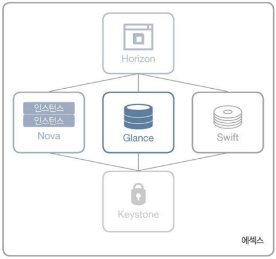

# 2장 오픈스택이란?

---

### 2.1 오픈스택의 역사

- 역사에 대한 내용은...
- Pass 하겠다...
- 요청이 있다면 다루겠다...
- 사실 구글링하면 다나옴...
- 올리기 귀찮으니까...
- 올리지 않겠음...
- 추가된 새 기능은 블로그에 계속 업데이트 된다.
- [필자의 블로그](http://naleejang.tistory.com/)

---

### 2.2 오픈스택과 아키텍처

- 오픈스택은 컴퓨트, 오브젝트 스토리지, 이미지, 인증 서비스 등이 유기적으로 연결되어 하나의 커다란 클라우드 컴퓨팅 시스템을 구축한다.

- 개념 아키텍처로 살펴보는 오픈스택의 변화
    - 첫 릴리즈
        - 하이퍼바이저와 연동해서 인스턴스를 생성하고 삭제하는 컴퓨트 서비스
        - 이때 필요한 운영체제 이미지를 관리하는 이미지 서비스
        - 이미지를 백업하는 오브젝트 스토리지 서비스

    

    - 그 후...
        - 서비스 개념으로 오픈스택을 릴리즈하기 시작하면서 프로젝트를 만들면 여기에 이름을 붙였다.
    
    - 벡사 버전부터...
        - Nova : 컴퓨트 서비스
        - Swift : 오브젝트 스토리지 서비스
        - Glance : 이미지 관리 서비스
    
    - 디아블로 버전까지 기능을 계속 업그레이드 했다.

    

    - 에섹스 버전의 릴리즈
        - 새로운 기능을 추가 : Keystone, Horizon
        - Keystone : 서비스들의 인증을 담당하는 프로젝트
        - Horizon : 서비스들을 좀 더 쉽게 이용하려고 사용자에게 대시보드를 제공하는 프로젝트
    
    

    - 폴섬 버전의 릴리즈
        - 새로운 서비스 프로젝트 추가 : Quantum, Cinder
        - Quantum : 네트워크 서비스, 오픈플로 사용(여러 네트워크 컨트롤러 지원 가능)
        - Cinder : 블록 스토리지 서비스
        - 기존 : Nova가 네트워크 서비스와 블록스토리지 서비스를 모두 담당했으나 폴섬 버전부터는 각각 프로젝트로 분리

    

    - 하바나 버전의 릴리즈
        - 새로운 서비스 프로젝트 추가 : Heat, Ceilometer
        - Heat : 오케스트레이션 서비스
        - Ceilometer : 텔레미터 서비스

    

    - 킬로 버전의 릴리즈
        - 이후 많은 프로젝트를 추가했다.

    

    - 이후에도 많은 서비스를 계속해서 추가하고 있다.

    - 6개의 코어서비스와 이를 지원하는 많은 서비스를 표현한 빅텐트(Big-tent)

    

- 논리 아키텍처로 살펴보는 오픈스택의 변화
    - 논리 아키텍처는 개념 아키텍처를 좀 더 자세히 표현한 오픈스택의 전체 구조이다.
    - Flowchart로 구성되어 있다... 궁금하면 구글링! ㅎㅎ

- 상황별 오픈스택 구성 요소
    - HTC(High Throughput Computing) :: 고성능 컴퓨팅(High Performance Computing)의 차이는...?
        > 데이터센터에 걸쳐 있는 수십만 개의 코어로 확장할 수 있게 설계된 클라우드를 구축할 때, HTC 사용자는 종종 Nova 컴퓨트로 전환해 Horizon 대시보드로 단일 API 엔드 포인트를 사용자에게 제공한다. Keystone은 일반적으로 사용자 계정이 저장되는 LDAP 백엔드를 연결하는 데 사용한다.

        - 위와 같은 프로젝트를 구성하려면 다음의 서비스가 필요하다
            - 대시보드 서비스 : Horizon
            - 텔레미터 서비스 : Ceilometer
            - 블록 스토리지 서비스 : Cinder
            - 오케스트레이션 서비스 : Heat
            - 이미지 서비스 : Glance
            - 인증 서비스 : Keystone
    
    - 웹 호스팅
        > 세계 최대 웹 호스팅 회사 중 하나인 고대디는 웹 사이트 수백만 개를 호스팅하는 데 오픈스택을 사용한다. 일반적인 코어 서비스를 이용하며, 사용자 계정 데이터를 수집하고 요금을 청구할 때 일부 기술로 Ceilometer를 활용한다.

        - 사용 서비스
            - 네트워크 서비스 : Neutron
            - 대시보드 서비스 : Horizon
            - 텔레미터 서비스 : Ceilometer
            - 이미지 서비스 : Glance
            - 인증 서비스 : Keystone
            - 컴퓨트 서비스 : Nova
    
    - 퍼블릭 클라우드
        > 오픈스택은 전 세계 사용자에게 IaaS를 제공하는 퍼블릭 클라우드를 지원한다.

        - 사용 서비스
            - 네트워크 서비스 : Neutron
            - 도메인 네임 서비스(DNSaaS : DNS as a Service) : Designate
            - 블록 스토리지 서비스 : Cinder
            - 오브젝트 스토리지 서비스 : Swift
            - 이미지 서비스 : Glance
            - 인증 서비스 : Keystone
            - 컴퓨트 서비스 : Nova

    - 웹 서비스, 전자상거래
        > 이베이, 오버스톡닷컴, 베스트바이 등 많은 회사가 오픈스택을 이용해 웹 서비스도 하고 전자상거래의 백엔드로도 사용한다. 상황에 따라서 오픈스택 클라우드는 PCI 표준처럼 엄격한 규정 준수 요건을 충족할 수 있게 구성하기도 한다.

        - 사용 서비스
            - 네트워크 서비스 : Neutron : SDN을 제공함
            - 대시보드 서비스 : Horizon
            - 데이터베이스 서비스(DaaS : Database as a Service) : Trove
            - 블록 스토리지 서비스 : Cinder
            - 이미지 서비스 : Glance
            - 인증 서비스 : Keystone
            - 컴퓨트 서비스 : Nova

    - 컴퓨트 스타터 키트
        > 오픈스택기술위원회는 더 많은 사람이 오픈스택을 사용할수 있도록 컴퓨트 스타터 킷을 정의 했다. 스타터 킷은 추가 기능으로 클라우드를 확장할 수 있는 방법을 문서화로 제공하는 단순한 프로젝트를 말합니다.

        - 사용 서비스
            - 네트워크 서비스 : Neutron
            - 이미지 서비스 : Glance
            - 인증 서비스 : Keystone
            - 컴퓨트 서비스 : Nova

    - 빅데이터
        > 차량의 센서 및 소셜 미디어 피드백과 다양한 리소스의 데이터를 분석하는 Top 10 Automaker(자동차 제조 업체)같은 오픈스택의 주요 사용 예는 확장 가능하고 탄력적인 인프라를 제공해 빅데이터를 수집하고 분석하는 것이다.

        - 빅데이터 분석 서비스 : Sahara
            - 오픈스택 위에 빅데이터 응용프로그램(Hadoop 또는 Spark)을 간단하게 제공할 수 있는 방법을 알려준다.

        - 사용 서비스
            - 네트워크 서비스 : Neutron
            - 대시보드 서비스 : Horizon
            - 베어메탈 서비스 : Ironic
            - 빅데이터 서비스 : Sahara
            - 이미지 서비스 : Glance
            - 인증 서비스 : Keystone
            - 컴퓨트 서비스 : Nova

    - DBaaS
        > 대부분의 회사는 응용프로그램을 백업하려고 DB에 크게 의존하며 일반적인 관리 자동화 및 스케일 아웃을 최우선으로 생각한다. 오픈스택 Trove 프로젝트는 이 기능을 제공하며, 여러 SQL 및 NoSQL 백엔드를 지원한다. 또 Ironic 프로젝트는 데이터베이스의 성능을 극대화하려고 베어메탈 프로비저닝을 제공한다.

        - 사용 서비스
            - 네트워크 서비스 : Neutron
            - 대시보드 서비스 : Horizon
            - 데이터베이스 서비스 : Trove
            - 도메인 네임 서비스 : Designate
            - 베어메탈 서비스 : Ironic
            - 블록 스토리지 서비스 : Cinder
            - 오브젝트 스토리지 서비스 : Swift
            - 이미지 서비스 : Glance
            - 인증 서비스 : Keystone
            - 컴퓨트 서비스 : Nova

    - 비디오 처리와 콘텐츠 전달
        > 제작 스튜디오나 주요 케이블 서비스 제공 업체 같은 곳의 비디오 처리와 콘텐츠 전달은 오픈스택의 보편적인 사용 예입니다. 한 예로 Keystone에서 최근 선보인 인증 표준은 이제 동일한 대시보드와 인증을 사용해 프라이빗 클라우드 및 퍼블릭 클라우드에서 비디오 콘텐츠를 원할하게 이동시킬 수 있다.

        - 사용 서비스
            - 네트워크 서비스 : Neutron
            - 오브젝트 스토리지 서비스 : Swift
            - 인증 서비스 : Keystone
            - 컴퓨트 서비스 : Nova
    
    - 컨테이너 서비스
        > 오픈 스택은 신기술과 통합해 사용자가 가상 머신, 컨테이너, 베어메탈에서 실행되는 워크로드를 단일 클라우드에서 운영할 수 있도록 개발되었다. 오픈스택 사용자는 Kubernetes, Mesos, Docker 같은 새로운 컨테이너 오케스트레이션 엔진과 통합하려고 Magnum 프로젝트에 액세스할 수 있다.

        - 사용 서비스
            - 네트워크 서비스 : Neutron
            - 대시보드 서비스 : Horizon
            - 베어메탈 서비스 : Ironic
            - 블록 스토리지 서비스 : Cinder
            - 이미지 서비스 : Glance
            - 인증 서비스 : keystone
            - 컨테이너 서비스 : Magnum
            - 컴퓨트 서비스 : Nova

---

### 2.3 가상 서버를 생성하는 컴퓨트 Nova

- Nova
    - 컴퓨트 서비스의 핵심
    - 하이퍼바이저, 메시지 Queue, 인스턴스 접속을 하는 콘솔 등 다양한 기능이 유기적으로 연결되어 가상 서버를 생성할 수 있는 시스템을 구성한다.

- 논리 아키텍처의 Nova
    
    

    - Nova는 대시보드나 콘솔에서 호출하는 nova-api에서 시작된다.
    - nova-api는 메시지 Queue를 이용해 nova-compute에 인스턴스를 생성하라는 명령어를 전달한다.
    - nova-compute는 하이퍼바이저 라이브러리를 이용해 하이퍼바이저에 인스턴스를 생성하라는 명령어를 전달한다.
    - 이때 하이퍼바이저가 인스턴스를 생성한다.
    - 생성된 인스턴스는 nova-api로 접근할 수 있으며, Nova의 모든 기능은 메시지 Queue로 처리할 수 있다.

- Nova가 지원하는 하이퍼바이저의 종류
    - [자세한 확인](https://wiki.openstack.org/wiki/HypervisorSupportMatrix)
    
    

    - 그룹 A
    > 자체 테스트를 완료해 안정적인 서비스를 할 수 있는 하이퍼바이저 드라이버
    
    - 그룹 B
    > 프로바이더가 테스트하는 하이퍼바이저 드라이버

    - 그룹 C
    > 몇 번의 테스만 하는 하이퍼바이저 드라이버

- 노드별로 설치되는 Nova
    
    

    - 컨트롤러 노드에 설치되는 Nova 프로세스
        - nova-api : Nova의 REST API 서버를 담당
        - nova-cert : X509 인증서 서비스를 제공하는 서버 데몬
        - nova-conductor : 코디네이션과 데이터베이스 쿼리를 지원하는 서버 데몬
        - nova-consoleauth : nova-console 인증을 제공
        - nova-novncproxy : novnc-console과 호환되는 웹 소켓 프록시
        - nova-scheduler : VM 인스턴스를 실행할 컴퓨트 노드를 선택하는 역할
        - nova-novaclient : Nova REST API를 사용하는 클라이언트 프로그램

    - 컴퓨트 노드
        - nova-compute-kvm : 인스턴스와 관련된 모든 프로세스를 처리
        - python-guestfs : 파일 생성 기능을 지원하는 Python 라이브러리, 가상 인스턴스를 생성할 때 사용
        - qemu-kvm : KVM 하이퍼바이저

- 주요 웹 사이트 :: 최신 정보나 더 자세한 정보
    - [소스 코드 내려받기](http://git.openstack.org/cgit/openstack/nova)
    - [코드 리뷰](https://review.openstack.org)
    - [문서](http://docs.openstack.org)
    - [개발자 문서](http://nova.openstack.org)
    - [런치패드](https://launchpad.net/nova)
    - [위키 사이트](https://wiki.openstack.org/wiki/Nova)

---

### 2.4 오브젝트 스토리지 Swift

- 논리 아키텍처의 Swift
    - Swift의 특징
        - 구성 : swift-proxy-server, swift-account-server, swift-container-server, swift-object-server
        - swift-proxy-server는 swift-account-server, swift-container-server, swift-object-server를 관리한다.
        - 어카운트, 컨테이너는 별도의 메타데이터가 데이터베이스로 관리된다.
        - 오브젝트는 저장 공간에 직접 저장되는 방식으로 설계되어 있다.
        - swift-proxy-server는 오픈스택의 Object API를 제공한다.
        - 사용자는 API를 사용해 데이터를 저장하거나 내려받을 수 있다.

    

- Swift읜 논리적 구성 요소
    - 스토리지 공간 여러 개를 합쳐 하나의 커다란 공간으로 가상화하고, 그 안에서 사용자만의 별도 스토리지 공간이 있는 것처럼 다시 가상화를 한다.
    - 사용자는 특성에 따라 데이터를 분류해서 저장할 컨테이너를 생성하고 해당 컨테이너에 데이터를 저장한다.
    
    - 정리
        - 인증 : 사용자 인증을 담당하는 기능
        - Account : 사용자 계정 및 컨테이너를 관리
        - Container : 저장 공간 단위로 컨테이너 안의 오브젝트 정보를 관리
        - Object : 실제 데이터
    
    

    - swift-proxy-server
        - 스토리지 노드 여러 개를 관리하며 사용자 인증을 담당
        - Keystone으로 인증을 처리하며, 프록시 서버와 함께 설치하기도 한다.

- Swift Ring의 개념
    - Swift 또한 Nova를 구성할 때와 마찬가지로 스토리지 노드가 여러 대 있다.
    - 각 스토리지 노드에는 swift-account-server, swift-container-server, swift-object-server가 실행된다.
    - 이때 서버들은 관리자가 설정한 해당 포트로 서로 통신한다.
    - 스토리지 노드 중 하나라도 손상이 되면 데이터를 잃지 않도록 데이터 복제 프로세스가 함께 실행된다.
    - 스토리지 노드 여러 대는 자신이 관리하는 데이터를 서로 공유하려고 이름이 Ring인 파일로 어떤 노드가 스토리지 노드인지, 어떤 데이터가 있는지 인지한다.
    - Ring 파일은 프록시 노드에서 생성해 모든 스토리지 노드가 동일하게 가지고 있다.

    

- Swift의 데이터 관리 방법
    - 사용자 계정 관리 : 어카운트
    - 디렉터리 개념 : 컨테이너
    - 실제 파일을 표현 : 오브젝트
    > Hong이라는 사용자가 Swift를 사용한다고 가정했을 때 Account DB에는 Hong이 생성한 컨테이너 정보가 관리되고, Container DB에는 컨테이너에 저장된 오브젝트들이 관리된다. 오브젝트는 실제 파일로 스토리지 노드의 저장 공간에 저장된다.
    
    

    - 데이터 관점에서 Swift : 어카운트가 컨테이너를 포함하고 컨테이너가 오브젝트를 포함하도록 관리한다.
    - 프록시 노드 한 대에 스토리지 노드 다섯 대로 구성하는 것을 권장함.
    - 규모에 따라 프록시 노드 여러 대를 사용할 수도 있다.

    

- Swift와 Keystone 관계
    - Swift에는 SwAuth를 이용하는 인증 방법과 KeyStone을 이용하여 인증하는 방법이 있다.
    - 최근에는 KeyStone을 이용해서 주로 인증하며, Keystone에는 프로젝트, 사용자, 롤이 있다.
        - 관리자(admin, swiftoperator)는 사용자와 컨테이너를 생성, 삭제할 수 있다.
        - 관리자는 오브젝트도 올리기, 내려받기, 삭제를 할 수 있다.
        - 일반 사용자(member)는 사용자와 컨테너를 생성할 수 없다.
        - 일반 사용자는 관리자가 미리 생성해서 권한을 준 컨테이너만 사용할 수 있다.
        - 일반 사용자는 관리자가 설정한 권한으로 오브젝트 목록을 확인할 수 있다.
        - 일반 사용자는 관리자가 설정한 권한으로 데이터를 올리고 내릴 수 있다.
        - 특정 사용자에게 관리자 권한을 부여하려면 리셀러어드민 롤을 주어야 한다.
        - 해당 사용자는 관리자가 할 수 있는 기능을 모두 사용할 수 있다.
        
        

    |Swift 기능|Operator 롤|Reseller 롤|일반 사용자(memeber)|
    |:---|:---:|:---:|:---|
    |컨테이너 내 오브젝트 조회|O|O|읽기 권한을 부여 받은 경우만|
    |컨테이너 생성, 삭제|O|O|X|
    |오브젝트 올리기, 내려받기|O|O|쓰기 권한을 부여 받은 경우만|
    |컨테이너 ACL 적용|O|O|X|

- Swift의 이레이저 코딩 기능과 스토리지 정책
    - 이레이저 코딩(Erasure Coding) : 스토리지 저장 공간을 효율적으로 관리할 수 있다.
    - 스토리지 정책(Storage Policy) : 다양한 물리 스토리지 디바이스를 정책별로 사용할 수 있게 지원한다.

    - 이레이저 코딩
        - HDFS, RAID 외의 스토리지에서 데이터 저장 공간의 효율성을 높이려고 설계된 데이터 복제 방식이다.
        - 이레이저 코드를 사용해 데이터를 인코딩하고, 데이터가 손실되면 디코딩 과정을 거쳐 원본 데이터를 복구하는 기법 중 하나이다.

        

    - 스토리지 정책
        - 여러 오브젝트링을 생성해 다양한 목적으로 클러스터를 세그먼트화 할 수 있다.
        - 수정된 해시링으로 클러스터에서 데이터가 있어야 할 위치를 결정하고, 어카운트, 컨테이너, 오브젝트에 해당하는 각 링을 스토리지 정책을 이용해 서로 다른 저장 개체를 서로 다른 링에서 사용하도록 할 수 있다.
        - 또한 스토리지 정책으로 3 리플리카(복제) 기본 정책과 2 리플리카를 사용하는 또 다른 정책을 생성하고 활용할 수 있다.
        - SSD를 스토리지 그룹에 추가하고 특정 컨테이너가 오브젝트를 저장하도록 스토리지 계층 정책을 생성할 수도 있다.
        - 이레이저 코드를 사용해 콜드 스토리지(저전력 스토리지) 계층도 정의할 수 있다.
        > A 회사에서 내부 스토리지 시스템을 구축한다고 가정할 때, A 회사에는 경영과 관련된 매우 중요한 업무 파일들을 취금하는 시스템과 일반적인 업무에서 사용하는 파일들을 취급하는 시스템이 있다. 또 직원들끼리의 친목을 도모하려고 SNS 시스템도 운영합니다. 이 회사에서는 오브젝트 스토리지를 구축하고, 모든 사내 파일을 오브젝트 스토리지로 통합하려한다. 어떤 스토리지 정책을 사용해야 효율적일까? 중요한 업무 파일은 3 리플리카가 적용된 컨테이너를 사용해 저장하고, 일반적인 업무에서 사용하는 파일은 2 리플리카가 적용된 컨테이너를 사용해 저장하도록 할 수 있다. 또한 SNS 시스템에서 올리는 일회성 사진이나 파일들은 중요하지는 않지만 임의로 삭제할 수 없으므로, 이때는 이레이저 코딩이 적용된 콜드 스토리지를 사용할 수 있다.

- 주요 웹 사이트 :: 최신 정보나 더 자세한 정보
    - [소스 코드 내려받기](https://github.com/openstack/swift)
    - [개발자 문서](http://nova.openstack.org)
    - [런치패드](https://launchpad.net/swift)
    - [위키 사이트](https://wiki.openstack.org/wiki/Swift)

---

### 2.5 운영체제 이미지를 관리하는 Glance

- Glance : 인스턴스의 운영체제에 해당하는 이미지를 관리한다. 다양한 하이퍼바이저에서 사용할 수 있는 VM 이미지를 관리하고 VM에 설치된 운영체제를 보관, 관리한다.

- 논리 아키텍처의 Glance

    

    - Glance 사용자들은 glance-api로 이미지를 등록, 삭제, 관리할 수 있다.
    - glance-api는 glance-registry와 Glance database에서 이미지를 관리한다.
    - 이미지를 등록할 때는 glance-registry로 Glance database에 저장된다.
    - 등록된 이미지를 사용할 때는 Glance database에 바로 사용를 요청한다.

- Glance의 구성 요소와 흐름

    

    - 관리자는 운영하려는 운영체제의 이미지를 glance-registry로 Glance Database에 등록한다.
    - 오픈스택 컴퓨트 서비스에서 인스턴스를 생성할 때는 Glance Database에 이미 저장된 이미지만으로도 인스턴스를 생성할 수 있다.
    - Glance는 Nova 옆에 항상 따라다닌다.

- 가상 머신 이미지 포멧
    - 이미지 포맷에는 어떤 VM을 사용하는지 정보가 들어가 있다.
    - 대체적으로 이미지를 내려받아 Glance에 등록할 때는 raw 포맷이나 qcow2 포맷으로 등록한다.

    |이미지 포맷|설명|
    |:---|:---|
    |aki|아마존 커널 이미지|
    |ami|아마존 머신 이미지|
    |ari|아마존 RAM 디스크 이미지|
    |iso|광학 디스크나 CD-ROM의 데이터 콘텐츠를 지원하는 아카이브 포맷|
    |qcow2|QEMU 에뮬레이터가 지원하는 포맷. 동적으로 확장 가능하며, Copy on Write를 지원한다|
    |raw|구조화되지 않은 디스크 포맷|
    |vdi|VirtualBox 모니터와 QEMU 에뮬레이터가 지원하는 디스크 포맷|
    |vhd|VMware, Xen, MS, VirtualBox 같은 가상 머신 모니터가 사용하는 일반적인 디스크 포맷|
    |vhdx|큰 디스크 크기를 지원하는 VHD 형식의 향상된 버전|
    |vmdk|일반적인 디스크 포맷으로 여러 가상 머신 모니터가 지원된다.|

- 컨테이너 포맷
    - 오픈스택 Nova에서 인스턴스를 생성할 때는 이미 하이퍼바이저에서 생성한 가상 머신에 운영체제를 설치한 이미지를 Glance에 등록시키고, 등록시킨 이미지를 이용해서 인스턴스를 생성한다.
    - 리눅스 운영체제 대부분은 오픈스택이나 아마존 AWS에서 바로 사용할 수 있는 클라우드 전용 이미지를 제공한다.
    - 레드헷 엔터프라이즈 리눅스는 구독권이 있거나 구매해야 받을 수 있다.

    |지원 운영체제|URL|
    |:---|:---|
    |CentOS|[6버전](http://cloud.centos.org/centos/6/images/)  [7버전](http://cloud.centos.org/centos/7/images/)|
    |CirrOS|[cirros](http://download.cirros-cloud.net/)|
    |데비안|[데비안](http://cdimage.debian.org/cdimages/openstack/)|
    |페도라|[페도라](https://getfedora.org/atomic/)|
    |MS 윈도우|[MS 윈도우](https://cloudbase.it/windows-cloud-images/)|
    |우분투|[우분투](http://cloud-images.ubuntu.com/)|
    |오픈 수세 및 수세 리눅스|[수세](goo.gl/fhL6Zb)|
    |레드헷 엔터프라이즈 리눅스|[레드헷](goo.gl/XNQEaU)|

- 주요 웹 사이트 :: 최신 정보나 더 자세한 정보
    - [소스 코드 내려받기](https://github.com/openstack/glance)
    - [개발자 문서](http://docs.openstack.org/developer/glance)
    - [런치패드](https://launchpad.net/glance)
    - [위키 사이트](https://wiki.openstack.org/wiki/Glance)

---

### 2.6 인증을 관리하는 Keystone

- Keystone
    - 인증 토큰을 비롯해 테넌트 및 사용자 관리, 서비스의 엔드포인트 URL 등을 관리하는 아주 중요한 서비스이다.
    - 인증에 성공하지 못하면 오픈스택의 그 어떤 서비스도 이용할 수 없다.
    - 사용자를 인증해 물리 서버의 자원을 사용할 수 있도록 관리한다.

- 논리 아키텍처의 Keystone
    
    

    - 구성 : keystone-all, Database, LDAP
    - keystone-all : 토큰, 카탈로그, 정책, 인증 등이 포함됨
        - Token Backend : 사용자별 토큰을 관리한다.
        - Catalog Backend : 오픈스택에서 모든 서비스의 엔드포인트 URL을 관리한다.
        - Policy Backend : 테넌트, 사용자 계정, 롤 등을 관리한다.
        - Identity Backend : 사용자 인증을 관리한다.

- 오픈스택에서의 Keystone 위치
    - Keystone은 타인이나 해커에게서 시스템을 안전하게 보호하고 사용자 등록, 삭제, 권한 관리, 사용자가 접근할 수 있는 서비스 포인트 관리까지 전반적인 사용자 인증을 관리한다.

    

- 도메인, 프로젝트, 그룹, 사용자, 롤의 개념과 관계
    - 사용자일 대는 **사용자 그룹인 프로젝트**, **사용자 계정 정보인 사용자 ID와 패스워드**, **사용자 권한인 룰**을 등록한다.

    

    - 도메인은 서로 분리되어 있다.
    - 각 도메인에는 프로젝트와 사용자가 있다.
    - 프로젝트는 사용자를 가질 수 있다.
    - 사용자게에는 롤이 있으며, 여러 프로젝트의 구성원이 될 수 있다.
    - 관리자 롤을 가진 사용자끼리, 일반 사용자 롤을 가진 사용자끼리 Grouping을 할 수 있다.
    > 회사의 사내 인트라넷 시스템을 개발한다고 가정했을 때, 인트라넷 시스템을 관리하는 관리자도 있을 것이고, 일반 사용자도 있을 것이다. 관리자는 시스템을 잘 개발하는 직원으로 정하고, 해당 직원이 인트라넷 시스템에 로그인해서 접속했을 때 보이는 메뉴와 일반 사용자 그룹에 속한 직원이 로그인해서 접속했을 때 보이는 메뉴는 다르게 구현해야 한다. 관리자는 시스템을 이용해 메뉴를 등록할 수 있으며, 어떤 링크를 연결할지 여부도 결정할 수 있다.
    - 회사는 Keystone의 도메인에 해당한다.
    - 관리자와 일반 사용자는 Keystone의 프로젝트에 해당한다.
    - 시스템을 잘 개발하는 직원은 관리자이면서 사용자이다.
    - 관리자가 시스템을 이용해 할 수 있는 역할은 롤에 해당한다.
    - 메뉴는 서비스에 해당하며, 메뉴에 연결할 링크는 엔드포인트 URL에 해당한다.

    

- 주요 웹 사이트 :: 최신 정보나 더 자세한 정보
    - [소스 코드 내려받기](https://github.com/openstack/keystone)
    - [개발자 문서](http://docs.openstack.org/developer/keystone)
    - [런치패드](https://launchpad.net/keystone)
    - [위키 사이트](https://wiki.openstack.org/wiki/Keystone)

---

### 2.7 네트워크를 관리하는 Neutron

- Neutron
    - 기존 오픈스택의 네트워크 서비스는 nova-network가 담당했으나, SDN(software Defined Network) 개념이 들어오면서 별도의 네트워크 프로젝트로 분리되었다.

- 논리 아키텍처의 Neutron
    - 구성 : neutron-server, Neutron L2 Agent *, neutron-l3-agent *, neutron-dhcp-agent, Queue, Neutron Database, Neutron 3rd Party Plugin
    - Neutron은 다양한 네트워크 플러그인과 네트워크 모델을 지원한다.

    

    - 사용자는 Neutron API를 이용해 neutron-server로 IP할당을 요청한다.
    - neutron-server는 들어온 요청을 Queue로 다시 요청한다.
    - Queue는 neutron-dhcp-agent와 Neutron 3rd Party Plugin으로 IP할당 지시를 내린다.
    - neutron-dhcp-agent와 Neutron 3rd Party Plugin은 지시 받은 작업 수행을 시작한다.
    - neutron-server는 수시로 작업상태를 Neutron Database에 저장한다.
    - 할당된 IP를 인스턴스에서 사용할 수 있다.

- Neutron이 지원하는 플러그인의 종류 :: 아래 링크에서 플러그인별 자세한 정보 확인
    |플러그인|URL|
    |:---|:---|
    |OpenvSwitch|[여기](http://openvswitch.org/)|
    |Cisco UCS/Nexus|[여기](http://wiki.openstack.org/cisco-neutron)|
    |Cisco Nexus 1000v|[여기](http://wiki.openstack.org/cisco-n1kv-neutron)|
    |Linuxbridge|[여기](goo.gl/VobFYb)|
    |Modular Layer 2|[여기](http://wiki.openstack.org/Neutron/ML2)|
    |Nicira NVP|[여기](http://www.nicira.com/)|
    |NEC OpenFlow|[여기](goo.gl/p8iV9b)|
    |Cloudbase Hyper-V|[여기](http://www.cloudbase.it/quantum-hyper-v-plugin/)|
    |MidoNet|[여기](http://www.midonet.org/)|
    |Brocade Neutron Plugin|[여기](https://github.com/brocade/brocade)|
    |PLUMgrid|[여기](https://wiki.openstack.org/wiki/PLUMgrid-Neutron)|
    |Mellanox Neutron Plugin|[여기](https://wiki.openstack.org/wiki/Mellanox-Neutron)|
    |Embrane Neutron Plugin|[여기](goo.gl/6jORks)|
    |IBM SDN-VE|[여기](https://wiki.openstack.org/wiki/IBM-Neutron)|
    |CPLANE NETWORKS|[여기](http://www.cplanenetworks.com/)|
    |Nuage Networks|[여기](http://www.nuagenetworks.net/)|
    |OpenContrail|[여기](http://www.opencontrail.org/)|
    |Lenove Networking|[여기](goo.gl/KwAJZO)|
    |Extreme Networks|[여기](http://www.extremenetworks.com/)|
    |Ruijie Networks|[여기](https://github.com/ruijie/rgos_quantum_plugin)|
    |Juniper Networks|[여기](goo.gl/e1FMSn)|
    |Calico Neutron Plugin|[여기](http://www.projectcalico.org/)|
    |BNC|[여기](https://github.com/China863SDN/DCFabric)|

- Neutron과 VRRP, DVR
    - 주노 이전 버전의 오픈스택 네트워크는 많은 사용자가 인스턴스를 생성하고 사용하는 과정에서 무수한 병목현상이 나타났다.
    - 별도의 네트워크 노드를 이용해서 모든 인스턴스의 외부 통신을 처리했기에 특정 사용자 수가 증가하면 네트워크가 느려진다거나 사용할 수 없는 일이 많이 발생했다.
    - VRRP를 사용한 DVR 기능을 추가했다.

    - VRRP(Virtual Router Redundancy Protocol)
        - LAN에서 정적으로 설정된 기본 라우터를 사용할 때, 하나 이상의 백업 라우터를 사용하는 방법을 제공하는 인터넷 프로토콜

        

        - VRRP를 사용하여 2개 이상의 라우터를 마스터 라우터와 백업 라우터로 설정하면 문제가 생겼을 때도 계속 네트워크를 사용할 수 있다.
        - VRRP 기술은 오픈스택의 네트워크 품질을 향상시켜주고, DVR(Distributed Virtual Router) 기능을 사용할 수 있게 한다.

    - DVR(Distributed Virtual Router)
        - VRRP 기능을 향상시킨다.
        - 분산 라우팅 기능을 사용할 수 있다.
        - HA(High Availability) 로드밸런신 기능을 사용할 수 있다.
        - 기존 HA 라우터와 마찬가지로 DVR/SNAT(Static NAT) HA 라우터는 다른 노드에서 실행되는 L3 Agent의 백업 DVR/SNAT 라우터에서 SNAT 서비스 장애를 빠르게 해결할 수 있다.

- 주요 웹 사이트 :: 최신 정보나 더 자세한 정보
    - [소스 코드 내려받기](https://github.com/openstack/neutron)
    - [개발자 문서](http://docs.openstack.org/developer/neutron)
    - [런치패드](https://launchpad.net/neutron)
    - [위키 사이트](https://wiki.openstack.org/wiki/Neutron)

---

### 2.8 블록 스토리지를 관리하는 Cinder

- Cinder
    - 블록 스토리지 서비스
    - Nova에서 생성된 인스턴스에 확장해서 사용할 수 있는 저장 공간을 생성, 삭제하고 인스턴스에 연결할 수 있는 기능을 제공한다.

- 논리 아키텍처의 Cinder
    - 구성 : cinder-api, Queue, Cinder Database, cinder-volume, Volume Provider, cinder-scheduler

    

    - cinder-api : 볼륨을 추가, 삭제
    - cinder-volume : 볼륨을 생성하고 Cinder Database에 볼륨 정보를 업데이트
    - Cinder는 물리 하드 디스크를 LVM으로 설정
    - 설정한 LVM은 cinder.conf와 nova.conf의 환경을 설정해서 cinder-volume을 할당할 수 있다.
    - cinder-api로 생성된 볼륨은 단일 인스턴스 또는 여러 인스턴스에 할당할 수 있다.

- Cinder가 지원하는 블록 스토리지 드라이버
    - 기본 블록 스토리지 드라이버는 iSCSI 기반의 LVM이다.
    - LVM은 하드 디스크를 파티션 대신 논리 볼륨으로 할당하고, 디스크 여러 개를 좀 더 효율적이고 유연하게 관리할 수 있는 방식이다.
    - LVM 논리 볼륨의 기본 물리 스토리지 단위는 파티션이나 전체 디스크 같은 블록 장치이다.
    - 이런 장치는 물리 볼륨으로 초기화해야 하며, 논리 볼륨을 생성하려면 물리 볼륨을 볼륨 그룹으로 통합해야 한다.
    - 그리고 논리 볼륨을 할당할 수 있는 디스크 공간을 생성한다.
    - 또한 논리 볼륨 그룹은 논리 볼륨 여러 개로 나누며 이 논리 볼륨에는 마운트 지점과 파일 시스템 유형이 부여된다.

    

    - Cinder는 LVM의 이 특성을 이용해서 논리 볼륨을 생성한다.
    - Cinder는 생성된 볼륨을 인스턴스에 할당해 디스크처럼 사용할 수 있다.

- 주요 웹 사이트 :: 최신 정보나 더 자세한 정보
    - [소스 코드 내려받기](https://github.com/openstack/cinder)
    - [개발자 문서](http://docs.openstack.org/developer/cinder)
    - [런치패드](https://launchpad.net/cinder)
    - [위키 사이트](https://wiki.openstack.org/wiki/Cinder)

---

### 2.9 대시보드 Horizon

- Horizon
    - 사용자가 웹 UI로 인스턴스 생성, 삭제, 관리 등을 쉽고 빠르게 처리할 수 있게 지원한다.
    - 아파치 웹 서버를 사용한다.
    - 대시보드는 Python과 Django 프레임워크로 구현되어 있다.

- 논리 아키텍처의 Horizon
    - 단순히 Horizon 자체 모듈만 존재한다.
    - 모든 서비스의 API와 연동해서 사용자에게 웹 서비스를 제공할 수 있다.

    

- Horizon 대시보드
    - 인스턴스 생성, 삭제, 재부팅 관리 등을 할 수 있다.
    - 인스턴스의 스냅샷을 저장할 수 있다.
    - IP 설정, 방화벽 설정을 할 수 있다.
    - 볼륨 스토리지를 생성하고 생성한 스토리지를 인스턴스와 연결할 수 있다.

- 주요 웹 사이트 :: 최신 정보나 더 자세한 정보
    - [소스 코드 내려받기](https://github.com/openstack/horizon)
    - [개발자 문서](http://docs.openstack.org/developer/horizon)
    - [런치패드](https://launchpad.net/Horizon)
    - [위키 사이트](https://wiki.openstack.org/wiki/Horizon)

---

### 2.10 옵셔널 서비스

- 옵셔널 서비스를 제대로 사용하면 효율적인 클라우드 관리와 운영에 많은 도움을 받을 수 있다.

- 텔레미터 서비스 Ceilometer
    - 클라우드에서 배포된 자원의 사용량과 성능을 측정해 사용자가 자원 상태를 모니터링할 수 있는 기능을 제공한다.
    - 분산된 클라우드 시스템의 자원 상태를 모니터링해 가시성과 통찰력을 제공하고 자원 통계를 확인할 수 있다.

- 오케스트레이션 서비스 Heat
    - 오케스트레이션 : 자원 관리, 배치, 정렬을 자동화한다는 의미
    - 인스턴스 생성의 일련의 과정을 자동화해서 인프라를 쉽게 배포할 수 있도록 지원하는 템플릿 기반 엔진
    - 오케스트레이션에서 사용되는 템플릿 언어는 인프라는 물론 서비스와 응용프로그램 전체 프로비저닝을 자동화하고 컴퓨팅, 스토리지, 네트워킹 구성 뿐만 아니라 배포 후 작업도 지정할 수 있다.
    - 오케스트레이션 엔진은 텔레미터 서비스와 특정 인프라 요소의 자동 스케일링을 수행할 수 있다.

- 데이터베이스 서비스 Trove
    - 오픈스택에서 실행될 수 있게 설계했다.
    - 관계형 데이터베이스 기능을 활용할 수 있다.
    - 클라우드 사용자와 데이터베이스 관리자는 필요에 따라 Trove를 이용해 데이터베이스 인스턴스를 제공, 관리할 수 있다.

- 데이터 프로세싱 서비스 Sahara
    - 사용자가 오픈스택 위에 빅데이터 애플리케이션인 Hadoop이나 Spark를 쉽게 제공할 수 있게 도와주는 서비스이다.
    - 프레임워크 버전, 클러스터 토폴로지, 노드 하드웨어 세부 사항 등 매개변수를 지정해 수행할 수 있다.

- 베어메탈 서비스 Ironic
    - 오픈스택의 베어메탈 서비스로 물리적인 컴퓨터를 관리하고 자원을 제공하는 구성 요소 모음이다.
    - 구성에 따라 다음과 같은 다른 여러 오픈스택 서비스와 상호작용할 수 있다.
        - IPMI 메트릭을 사용하는 오픈스택 텔레미터 모듈(Ceilometer)
        - 인증 요청 및 다른 오픈스택 서비스를 인증하는 오픈스택 인증 서비스(Keystone)
        - 이미지 및 이미지 메타데이터를 검색할 수 있는 오픈스택 이미지 서비스(Glance)
        - DHCP 및 네트워크를 구성하는 오픈스택 네트워크 서비스(Neutron)
        - 오픈스택 네트워크 서비스인 Nova는 베어메탈 서비스와 함께 동작하고, 인스턴스를 관리하는 사용자용 API를 제공하며, 하드웨어를 관리할 수 있는 운영자용 API를 제공한다. 또 오픈스택 컴퓨트 서비스는 베어메탈 서비스가 제공하지 않는 예약 기능, 테넌트 할당, IP 할당, 기타 서비스를 제공한다.
        - 오픈스택 오브젝트 스토리지 서비스인 Swift는 드라이브 설정, 사용자 이미지, 배포 로그 및 점검 데이터의 임시 저장소를 제공한다.

- 기타 서비스
    - 메시징 서비스 Zaqar
        - 웹 및 모바일 개발자를 위한 멀티 테넌트 클라우드 메시징과 알림 서비스이다.
        - 여러 구성 요소 간에 메시지를 보낼 수 있게 하는 REST API가 있다.
        - 확장성 및 보안을 고려해 설계된 효율적인 메시징 엔진이다.

    - 공유 파일 시스템 서비스 Manila
        - 파일 스토리지를 가성머신에 제공한다.
        - 공유 파일 관리 및 프로비저닝을 지원한다.
        - Manila 서비스는 드라이버가 지원하면 공유 스냅샷 관리뿐만 아니라 공유 유형 관리도 활성화 한다.

    - DNS 서비스 Designate
        - 다음 DNS 서비스를 제공한다.
            - 도메인 및 레코드를 관리하는 REST API
            - 다중 사용자 지원
            - 인증을 하려고 Keystone과 통합
            - Nova 및 Neutron 알림과 통합할 수 있는 프레임워크
            - PowerDNS 및 BIND9 지원

    - 키 관리 서비스 Barbican
        - 암호, 암호화 키, X.509 인증서 같은 보안을 저장하고 프로비저닝 및 관리를 하려고 설계된 REST API이다.
        - 대규모 클라우드를 포함하므로 모든 환경에서 유용하다.

    - 컨테이너 서비스 Magnum
        - 오픈스택 API 서비스로 Docker Swarm, Kubernetes, Apache Mesos 같은 컨테이너 오케스트레이션 엔진을 오픈스택의 일부 리소스로 사용할 수 있다.
        - Magnum은 Docker 및 Kubernetes가 포함된 OS 이미지를 생성하려고 Heat를 사용하며, 클러스터 구성에서 가상 시스템을 실행하거나 베어메탈에서 해당 이미지를 실행한다.

    - 애플리케이션 카탈로그 서비스 Murano
        - 응용프로그램 개발자와 클라우드 관리자가 탐색 가능한 범주화된 카탈로그에 다양한 클라우드 지원 응용프로그램을 게시할 수 있게 한다.
        - 그러면 경험이 없는 사용자는 버튼을 눌러 신뢰할 수 있는 응용프로그램 환경을 구성하는데 카탈로그를 사용할 수 있다.
        - 핵심 목표 : 응용프로그램 추상화 수준에서 복잡한 환경을 작성 및 배포하고 라이프 사이클을 관리할 수 있는 UI 및 API를 제공하는 것
        - 다양한 응용프로그램 및 서비스의 통합되는 지점이 되는 반면에, 실제 배포 자체는 기존 소프트웨어 조정 도구로 수행된다.

    - 거버넌스 서비스 Congress
        - 동적 인프라 관리 및 규정 준수를 하려고 모든 클라우드 서비스 컬렉션에서 서비스로 정책을 제공하는 오픈스택 프로젝트
        - Congress 정책 서비스로 IT 서비스는 자체 비즈니스 정책에 따라 강력한 컴플라이언스 및 관리를 유지하면서 새로운 애플리케이션을 온보딩해 오픈스택 발자국을 확장할 수 있다.
        - 이 모든 것은 공급 업체가 공통 인터페이스에 연결할 수 있는 커뮤니티 기반 구현을 활용하기 때문이다.